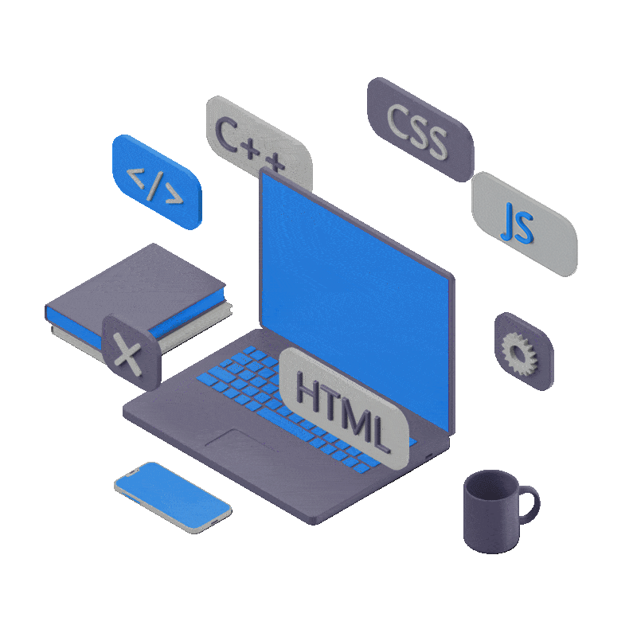

<!-- <table align="center">
  <tr>
    <td> -->

      <h1 align="center"> Front-end developer • Futurologist </h1>
<!--       </td>
  </tr> 
</table>-->
<picture>
    <source media="(prefers-color-scheme: dark)" srcset="assets/laptop-dblue-js-edited.gif">
    
</picture>
 

   

  &nbsp;💻  <strong>Languages and Tools</strong>
  

   

<!-- 🎨 Frontend -->

  &nbsp;&nbsp;
  &nbsp;&nbsp;
  &nbsp;&nbsp;
  &nbsp;&nbsp;
  &nbsp;&nbsp; 
  &nbsp;&nbsp;  
  

<!-- ⚙️ Backend -->

<!--   &nbsp;&nbsp;
  &nbsp;&nbsp;
  &nbsp;&nbsp; -->
  <!--  -->

<!-- 🧰 Tools -->

  &nbsp;&nbsp;
  <!-- &nbsp;&nbsp; -->
  &nbsp;&nbsp;
  

<!-- 🧠 Languages -->

  <!-- &nbsp;&nbsp; -->
  &nbsp;&nbsp;
  <!--  -->

<!-- 💻 OS -->
<!-- 

  

 -->
<em>English:&nbsp;&nbsp; Intermediate - Upper Intermediate</em> <!--   -->

  

&nbsp;🔎  <strong>GitHub Stats</strong>
  

  <!--   -->

    
  

&nbsp;&nbsp;&nbsp; 

     
 

   

  &nbsp;🧊  <strong>CodeWars</strong>
  

 

<a href="https://www.codewars.com/users/ZViacheslavV" target="&lowbar;blank">

  

&nbsp;🌐  <strong>Contacts</strong>
  

 
  

