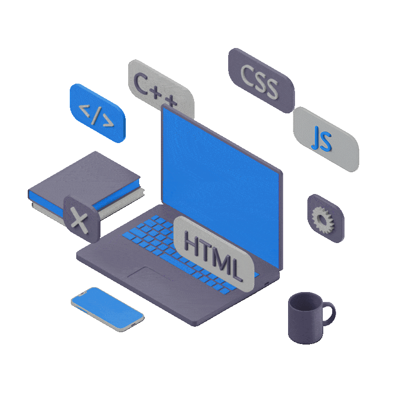
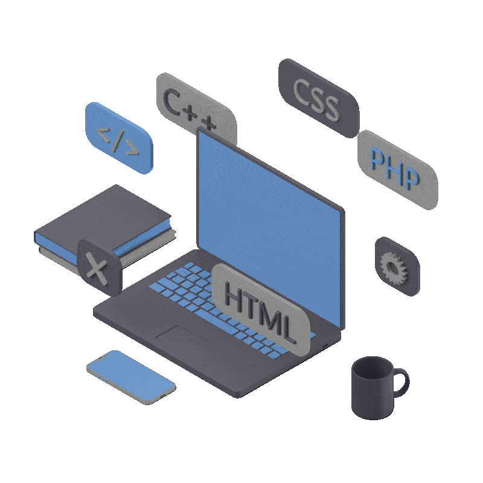
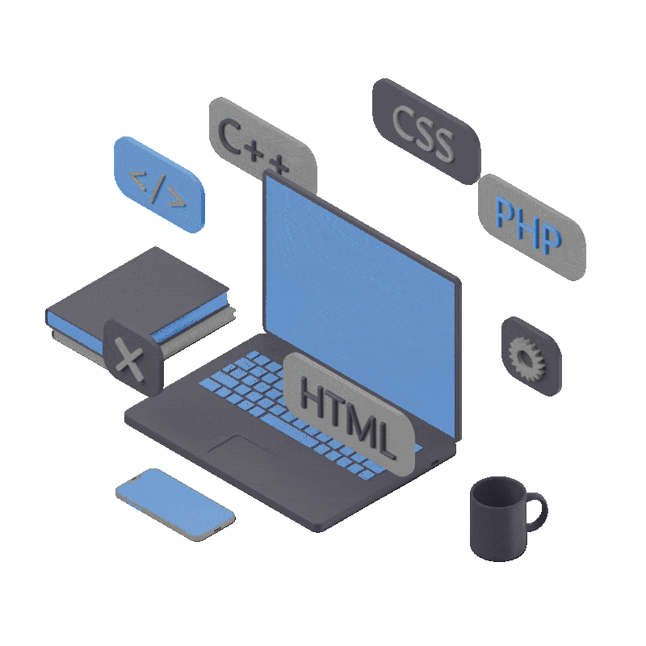

---
<picture>
    <source media="(prefers-color-scheme: dark)" srcset="laptop-dblue-js-edited.gif">
    
</picture>

   

  &nbsp;⚙️  <strong>Tech Stack and Tools</strong>
  

   
<table aligh='left'>
  <tr>
    <td align="center"></td>
    <td align="center"></td>
    <td align="center"></td>
    <td align="center"></td>
  <!-- </tr>
  <tr> -->
    <td align="center"></td>
    <td align="center"></td>
    <td align="center"></td>
    <td align="center"></td>
  </tr>
    <tr>
    <td align="center">
    JavaScript
  </td>
    <td align="center">TypeScript</td>
    <td align="center">React</td>
    <td align="center">Vite</td>
  <!-- </tr>
  <tr> -->
    <td align="center">Tailwind</td>
    <td align="center">HTML5</td>
    <td align="center">CSS3</td>
    <td align="center">VS Code</td>
  </tr>
</table>
     

  

&nbsp;📈  <strong>GitHub Stats</strong>
  

  <!--  -->
    
  

     
 
<!--  -->
<!--  -->

<!-- 

 -->

   

  &nbsp;💻  <strong>CodeWars Stats</strong>
  

 

<a href="https://www.codewars.com/users/ZViacheslavV">

<!---->

 
 
 
 
 
 
 
 
 
 
 
 
 
 
 
 
 
 
 
 
 
 
 
 
 
 
 
 
 
 
 
 
 
 
 
 
 
 
 

<!-- 🌌 Profile Badges Section -->

<!-- GitHub Stats -->

<!-- Build & Quality -->

<!-- Tech Stack -->

<!-- Tools -->

<!-- Social -->

  

  

  

---

<table align="center">
  <tr>
    <td>

      <h1 align="center"><!-- Visionary • --> Full-Stack developer • Futurologist <!--| Full-Stack  JavaScript --> <!-- path --> <!-- • Future-Oriented Thinker --></h1>
      </td>
  </tr>
</table>
<!--
🌌 Viacheslav | Visionary Full-Stack Developer
-->
<!-- <h1 align="center">👋 Hi, I'm Viacheslav</h1> -->

---
 <!-- -->

<!-- <picture>
    <source media="(prefers-color-scheme: dark)" srcset="laptop-dark-more-blue.gif">
    
</picture> -->
### 📊 GitHub Stats

  
  

<picture>
    <source media="(prefers-color-scheme: dark)" srcset="laptop-dblue-js-edited.gif">
    
</picture>

<!--<picture>
    <source media="(prefers-color-scheme: dark)" srcset="laptop-darkest-most-blue.gif">
    
</picture>

<picture>
    <source media="(prefers-color-scheme: dark)" srcset="laptop-darkest-blue-high.gif">
    -->
</picture>
---
<!-- ### 🧠 About Me  
I’m a **futurologist and visionary in the making**, passionate about building technologies that serve people and shape a better tomorrow.  
With a foundation in **C++** and growing expertise in **JavaScript**, I specialize in **React**, **Next.js**, **Node.js**, **MongoDB**, and **SQL** — crafting full-stack applications that balance functionality, performance, and impact.  

<!--💡 *Code for people. Code for the future.*  -->

---

<!--

-->

  

⚙️ Tech Stack  
  

<!-- #### 🖥️ Frontend  

   ,tailwind

#### ⚙️ Backend  

   ,express,mongodb,postgres,sqlite

 -->

#### ⚙️ Full-stack

   <!-- ,tailwind height='100px'-->

#### 🧰 Tools & Other  

   <!-- ,docker height='100px'-->

---

### 👋 Hi, I'm Viacheslav

Building things that matter — at the intersection of **AI, data, and full-stack engineering**.  
Always learning. Always moving forward.

---

### 📊 Stats

---

### 🧠 Focus
<!--`AI / Machine Learning` -->• `Full-Stack JavaScript` • `Next.js / React` • `TypeScript` • `Visionary Engineering`

---

### 🧩 Toolbox

---

### 📈 Profile Insights

---

> _“The best way to predict the future is to build it.”_  
> — Alan Kay

---
###SECOND VARIANT:
<!-- 👨‍💻 FAANG-Style GitHub Profile for ZViacheslavV -->

<h1 align="center">👋 Hi, I'm Viacheslav</h1>

  <b>Vision-driven Engineer</b> crafting scalable systems at the intersection of <b>AI, Data, and Full-Stack JavaScript</b>.

  <i>“The best way to predict the future is to build it.” — Alan Kay</i>

---

### 🧠 Core Focus

- 🤖 Artificial Intelligence & Future Tech  
- 🧩 Full-Stack JavaScript (Next.js, React, Node.js)  
- 🧮 Data-driven Systems & API Design  
- 🧭 Long-term Vision & Human Impact  

---

### ⚙️ Tech Stack

  
  
  
  
  
  
  

  
  
  
  
  
  
  

Clean Horizontal Line (FAANG-style)

  
  
  
  
  
  
  
  

Minimalistic Grid (great for portfolio clarity)
<table>
  <tr>
    <td align="center"> JavaScript</td>
    <td align="center"> TypeScript</td>
    <td align="center"> React</td>
    <td align="center"> Vite</td>
  <!-- </tr>
  <tr> -->
    <td align="center"> Tailwind</td>
    <td align="center"> HTML5</td>
    <td align="center"> CSS3</td>
    <td align="center"> VS Code</td>
  </tr>
</table>
Minimalistic My var Grid (great for portfolio clarity)

  

⚙️ Tech Stack  
  

<table>
  <tr>
    <td align="center"></td>
    <td align="center"></td>
    <td align="center"></td>
    <td align="center"></td>
  <!-- </tr>
  <tr> -->
    <td align="center"></td>
    <td align="center"></td>
    <td align="center"></td>
    <td align="center"></td>
  </tr>
    <tr>
    <td align="center">
    JavaScript
  </td>
    <td align="center">TypeScript</td>
    <td align="center">React</td>
    <td align="center">Vite</td>
  <!-- </tr>
  <tr> -->
    <td align="center">Tailwind</td>
    <td align="center">HTML5</td>
    <td align="center">CSS3</td>
    <td align="center">VS Code</td>
  </tr>
</table>

  

<table align="center">
  <tr>
    <td align="center"></td>
    <td align="center"></td>
    <td align="center"></td>
    <td align="center"></td>
  <!-- </tr>
  <tr> -->
    <td align="center"></td>
    <td align="center"></td>
    <td align="center"></td>
    <td align="center"></td>
       
  </a></td>
    <td ></td>
    <td ></td>
    <td ></td>
  <!-- </tr>
  <tr> -->
    <td ></td>
  </tr>
    <!-- <tr>
    <td align="center">
    JavaScript
  </td>
    <td align="center">TypeScript</td>
    <td align="center">React</td>
    <td align="center">Vite</td>
    <td align="center">Tailwind</td>
    <td align="center">HTML5</td>
    <td align="center">CSS3</td>
    <td align="center">VS Code</td>
         <td align="center">TypeScript</td>
    <td align="center">React</td>
    <td align="center">Vite</td>
    <td align="center">Tailwind</td>
  </tr> -->
</table>

  
Animated Centered Stack (modern & eye-catching)
<h3 align="center">🛠️ My Tech Stack</h3>

  
  
  
  
  
  
  
  

---

### 📊 GitHub Stats

  
  

---

### 🛰️ Active Projects

| Project | Description | Stack |
|----------|--------------|-------|
| 🗒️ **NoteHub** | Smart Notes App with AI-powered organization | Next.js • React Query • PostgreSQL |
| ⚡ **AutoFlow** | Workflow automation engine with custom triggers | Node.js • TypeScript • REST APIs |
| 🧠 **VisionCraft** | Experimental AI prototypes for decision systems | Python • JS • OpenAI API |

---

### 📈 Insights

  
  
  

---

### 🌐 Connect

  
  
  

---

Built with ☕, ⚛️, and a vision for a better digital future.

---

<a href="https://www.codewars.com/users/ZViacheslavV">

  
<!--
### 🚀 Current Focus  
- Advancing my **backend architecture** and **API design** skills  
- Building **scalable full-stack apps** with modern tools  
- Exploring **AI-driven web applications**  
- Growing toward my **future startup vision**  

---

### 🌟 Core Strengths  
- Analytical & systems thinking  
- Creative problem-solving  
- Leadership & team collaboration  
- High emotional intelligence  
- Fast, efficient learning and adaptability  -->

<!-----

### 📊 GitHub Stats  

  
  

--- -->

### 📬 Connect With Me  

  
  

---

# Hi 👋, I'm 111

### 111

- 🔭 I'm currently working on **222**

- 🌱 I'm currently learning **333**

- 👯 I'm looking to collaborate on **444**

- 🤝 I'm looking for help with **555**

- 💬 Ask me about **666**

- 📫 How to reach me **777**

- ⚡ Fun fact **888**

<h3 align="left">Connect with me:</h3>

<h3 align="left">Languages and Tools:</h3>

                 

